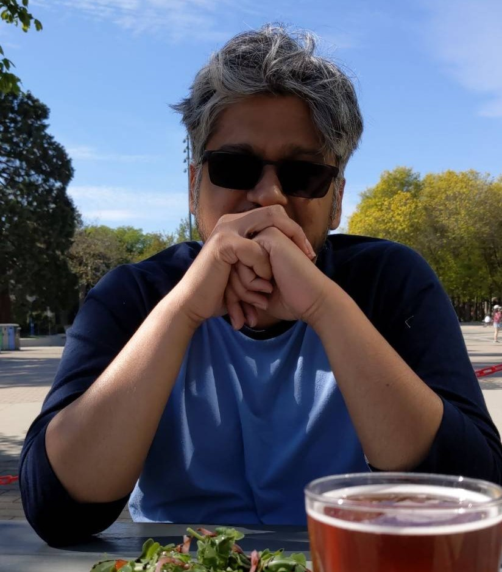
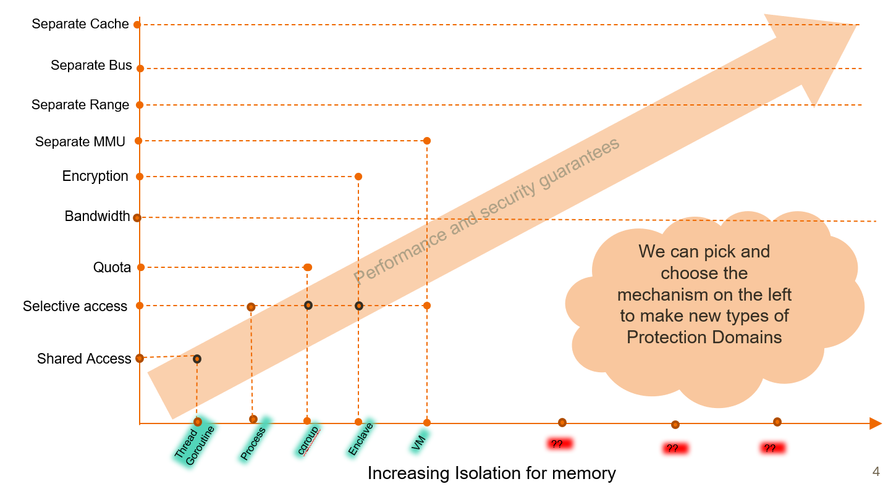

# About

 

I am a first-year Ph.D. student at the [University of British Columbia](https://www.cs.ubc.ca/) in Canada and a member of the [Systopia Lab](https://systopia.cs.ubc.ca/) here. 
My advisor is [Prof. Margo Seltzer](https://www.seltzer.com/margo/).
I have worked as a [software engineer](https://www.linkedin.com/in/sidhartha-agrawal/) for eight years(Oracle, Arista in Canada and USA) 
and have begun my research journey in Jan 2021.

My primary research interest is in operating systems. 

# Research Projects

## General Purpose Isolation Mechanisms

After sixty years of operating systems evolution, we continue to find new and different isolation mechanisms: threads, processes, containers, virtual machines, lightweight contexts. 
Even applications provide isolation mechanisms: a JVM is a user-level process that provides isolation units whose API is Java bytecodes; some browsers offer units of isolation between each browser tab.

We ask whether we really need to have N different isolation mechanisms or, instead, we could develop a framework in which all these different mechanisms represent points on a continuum. 
If we could do that, then perhaps A) we could implement such a unified framework, and B) the framework might allow us to discover new and useful isolation mechanisms (that could be created seamlessly rather than requiring an entirely new implementation).

The project has three main goals:
* Develop a theoretical model or framework to unify existing isolation mechanisms.
* Identify novel points in the model that are useful.
* Implement the model in seL4.

Below is an example on how we can view memory as a resource that be shared and isolated across different types of protection domains.
This is an evolving diagram, as we are still investigating if the "Security and Performance Guarantees" across any two
types of protection domains can be compared.

# Coursework
### Spring 2021
-   CPSC 508: Graduate Operating Systems [www](<https://www.seltzer.com/margo/teaching/CS508.21/index.html>)

### Summer 2021
- EEL: 571S: Techniques for Simulating Novel Hardware Architectures in the Context of OS Research [www](<https://docs.google.com/document/d/1EAniq36LdA8tReo9KYm-bTFcrvbMwkutUSN8KiLYIiU/edit#heading=h.bdy4i2cqmbbn>)

# Contact
-   sid[at]sid-agrawal[dot]ca
