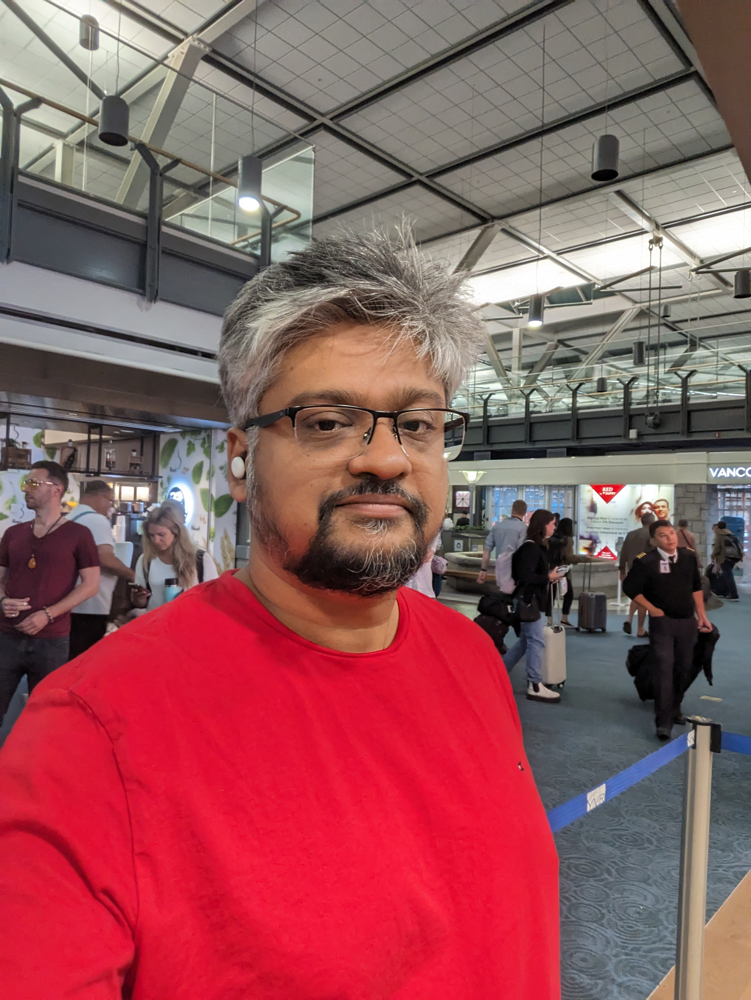

I currently work as a software engineer at VMware/Broadcom, 
where I contribute to building the virtual machine monitor and specialize in confidential computing. 
Concurrently, I am a Ph.D. candidate at the [University of British Columbia](https://www.cs.ubc.ca/), 
where I am a member of the [Systopia Lab](https://systopia.cs.ubc.ca/) advised by [Prof. Margo Seltzer](https://www.seltzer.com/margo/). 
My academic research is centered on operating systems architecture and security.

My research journey began in January 2021, following an eight-year career as a software engineer at companies like Oracle and Arista. 
I also had the opportunity to intern at ARM Research in the summer of 2022, where I focused on seL4 and CHERI capabilities.

# Research Projects

> If any of this piques your interest, shoot me an email.

## Operating Systems have way too many isolation mechanisms, but help is on the way.

After sixty years of operating system evolution, we continue to find new and different isolation mechanisms: threads, processes, containers, virtual machines, and lightweight contexts.
Even applications provide isolation mechanisms: a JVM is a user-level process that provides isolation units whose API is Java bytecodes; some browsers offer units of isolation between each browser tab.

We ask whether we really need to have N different isolation mechanisms or, instead, we could develop a framework in which all these different mechanisms represent points on a continuum.
If we could do that, then perhaps A) we could implement such a unified framework, and B) the framework might allow us to discover new and useful isolation mechanisms (that could be created seamlessly rather than requiring an entirely new implementation).

The project has three main goals:
* Develop a theoretical model or framework to `compare` existing isolation mechanisms.
* Identify novel points in the model that are useful, and demonstrate that the sharing and isolation has a spectrum.
* Implement the model in seL4, or any other suitable platform.
    * Prototype OS CellulOS: [Wiki](https://cellulosdocs.readthedocs.io/en/cellulos/index.html) and [src](https://github.com/sid-agrawal/OSmosis)

Below is an example of how we can view threads, processes, and virtual machines as more isolated than the previous one.
This is an evolving diagram, as we are still investigating if the "Security and Performance Guarantees" across any two
types of protection domains can be compared.

> I gave a lightning(gong) talk at [HPTS2022](hpts.ws) based on this work. More details available in our [Arxiv submission](https://arxiv.org/abs/2309.09291), and [SOSP 2023 Poster](https://sid-agrawal.ca/OSmosis_SOSP_2023_Poster.pdf)

## Exciting Hardware Features
[CHERI](https://www.cl.cam.ac.uk/research/security/ctsrd/cheri/) is a new ISA extension to enable capabilities in hardware.
And [Morello](https://www.arm.com/architecture/cpu/morello) is the first silicon to have this ISA extension.
I have been looking at how this hardware capability impacts the design of existing capabilities-based microkernels like seL4.
This work was done during my internship at ARM Research in the summer of 2022.

> Here is a blog post about the work done over that summer [www](https://sid-agrawal.ca/sel4,/cheri,/morello,/aarch64,/cheribsd/2023/01/01/seL4-CHERI.html).

## Intra-kernel Compartmentalization
Monolithic kernels like  Linux, BSD, and Windows are behemoths that share a single address space.
Various techniques have been proposed to improve the reliability of these monolithic kernels.
We are looking at the state of the art and where it might go next based on new hardware trends.

# Publications
* Comparing Isolation mechanisms using OSmosis
    * Soo Yee Lim, <ins>Sidhartha Agrawal</ins>, Xueyuan Han, David Eyers, Dan O'Keeffe, Thomas Pasquier
    * PLOS 2025
    * PDF will be available in late Sep 2025
* Securing Monolithic Kernels using Compartmentalization
    * Soo Yee Lim, <ins>Sidhartha Agrawal</ins>, Xueyuan Han, David Eyers, Dan O'Keeffe, Thomas Pasquier
    * ArXiv
    * [PDF](https://arxiv.org/pdf/2404.08716.pdf)
* OSmosis: No more Déjà vu in OS isolation
    * <ins>Sidhartha Agrawal</ins>, Reto Achermann, and Margo Seltzer
    * ArXiv
    * [PDF](https://arxiv.org/abs/2309.09291)
* CHERI-picking: Leveraging capability hardware for prefetching.
    * Shaurya Patel,  <ins>Sidhartha Agrawal</ins>, Alexandra Fedorova, and Margo Seltzer.
    * [12th Workshop on Programming Languages and Operating Systems (PLOS 2023)](https://plos-workshop.org/2023/)
    * [PDF](https://dl.acm.org/doi/pdf/10.1145/3623759.3624553)

# Posters
* OSmosis: Modeling & Building Flexible OS Isolation Mechanisms
    * <ins>Sidhartha Agrawal</ins>, Shaurya Patel, Reto Achermann, and Margo Seltzer
    * [SOSP 2023 Poster Session](https://sosp2023.mpi-sws.org/cfpo.html)
    * [Submission](https://sid-agrawal.ca/OSmosis_SOSP_2023_Poster_Submission.pdf) & [Poster](https://sid-agrawal.ca/OSmosis_SOSP_2023_Poster.pdf)
* OSmosis: Modeling & Building Flexible OS Isolation Mechanisms
    * <ins>Sidhartha Agrawal</ins>, Reto Achermann, and Margo Seltzer
    * [Salmon 2023 Poster Session](https://systopia.cs.ubc.ca/event)
    * [Poster](https://sid-agrawal.ca/OSmosis_Salmon_2023_Poster.pdf)

# Talks
* Longer talk on OSmosis/CellulOS
    * [seL4 Summit 2025](https://sel4summit2025.sched.com/event/26GFQ?iframe=no): CellulOS: An OS for Comparing Isolation Mechanisms
        * Slides & Video will be available in late Sep 2025

* Short talk on OSmosis
    * [Gong Show at HPTS 2022](http://www.hpts.ws/papers/2022/agenda.html)
        * [Slides](http://www.hpts.ws/papers/2022/HPTS-2022-Gong-Show.pdf) (scroll to page 64)

# Conferences Attended
* [SOSP 2023](https://sosp2023.mpi-sws.org/), Coblenz, Germany `Helped with PC meeting logistics`
* [seL4 Summit 2023](https://sel4.systems/Foundation/Summit/2023/), Minneapolis, MI, USA
* [OSDI 2023](https://www.usenix.org/conference/osdi23), Boston, MA, USA
* [HPTS 2022](http://hpts.ws/index.html), Monterey, California, USA: `Gave a lightning talk on OS isolation mechanisms`
* [OSDI 2022](https://www.usenix.org/conference/osdi22), San Diego, California, USA
* [Hot Carbon 2022](https://hotcarbon.org/), San Diego, California, USA
* [SOSP 2021](https://sosp2021.mpi-sws.org/): Virtually
* [HotOS 2021](https://sigops.org/s/conferences/hotos/2021/): Virtually

# Coursework
- CPSC 504: Data Management & DBMS Research [www](https://www.cs.ubc.ca/~rap/teaching/504/2022W2/index.shtml)
- CPSC 538A: Operating Systems Design and Implementation using Barrelfish(Audit) [www](<https://www.cs.ubc.ca/~achreto/teaching/538/>)
- CPSC 513: Formal Verification [www](<https://www.cs.ubc.ca/~ajh/courses/cpsc513/index.html>)
- CPSC 538M: Security and Privacy in the Era of Side Channels(Audit) [www](<https://aasthakm.github.io/courses/cpsc538m.html>)
- EEL 571S: Techniques for Simulating Novel Hardware Architectures in the Context of OS Research [www](<https://docs.google.com/document/d/1EAniq36LdA8tReo9KYm-bTFcrvbMwkutUSN8KiLYIiU/edit#heading=h.bdy4i2cqmbbn>)
- CPSC 508: Graduate Operating Systems [www](<https://www.seltzer.com/margo/teaching/CS508.21/index.html>)

# Contact
-   sid[at]sid-agrawal[dot]ca
